# Port Support Engineer Assignment Submission

## Overview

This document contains my solutions to the Port Support Engineer assignment exercises. All exercises have been completed using real data from integrations and applications, with no mock data used. Each solution includes detailed explanations, evidence of functionality, and technical implementation details.

---

## Exercise 1: JQ Patterns

### Sample Data

**K8s Deployment Object:** [K8s Gist](https://gist.github.com/MPTG94/8fc7f5d19d42cdb4e2a111fa65a91254)
**Jira API Issue Response:** [Jira Gist](https://gist.github.com/MPTG94/c33e47ff18cbe987c7b1c64e202ce6e1)

### Solutions

#### 1a. Extract Current Replica Count

**JQ Pattern:**

```jq
.spec.replicas
```

**Explanation:** This pattern navigates to the `spec` object and extracts the `replicas` field, which contains the desired number of pod replicas for the deployment.

The `dot (.)` operator gets the current input data, `spec `fetches the spec dictionary, next `.`get's that data as the current input and `replicas `returns the data available in the `replica` attribute

**Output:** `1`

**Testing Evidence:**
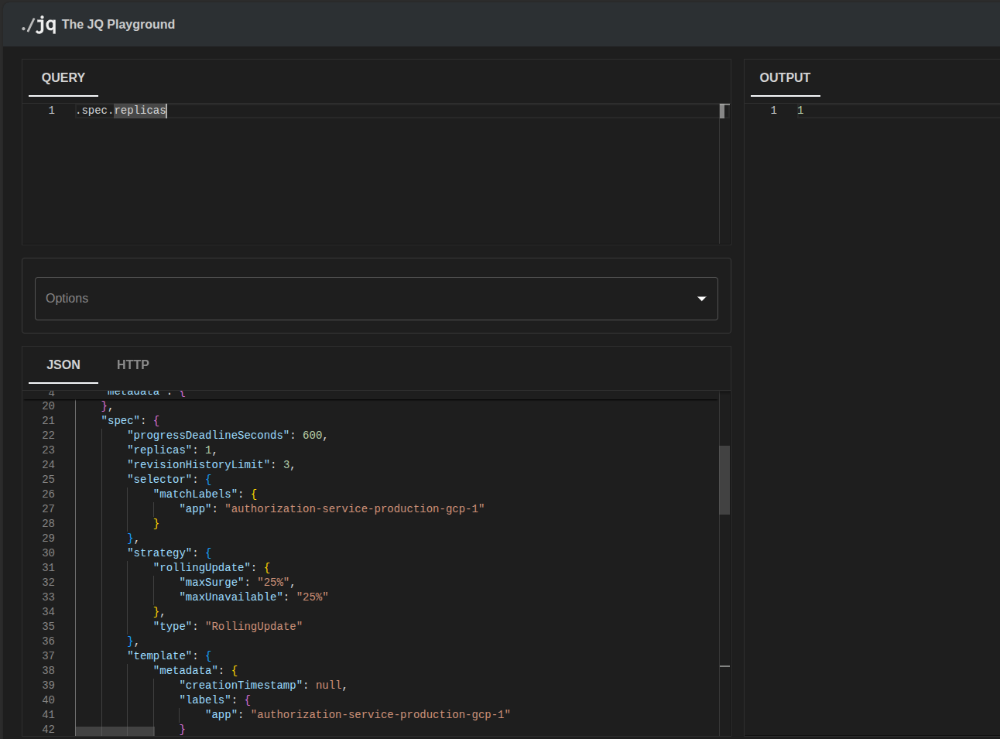
*JQ Playground verification showing successful extraction of replica count value "1"*

#### 1b. Extract Deployment Strategy

**JQ Pattern:**

```jq
.spec.strategy.type
```

**Explanation:** This pattern navigates to the deployment strategy configuration and extracts the strategy type.

**Output:** `"RollingUpdate"`

**Testing Evidence:**
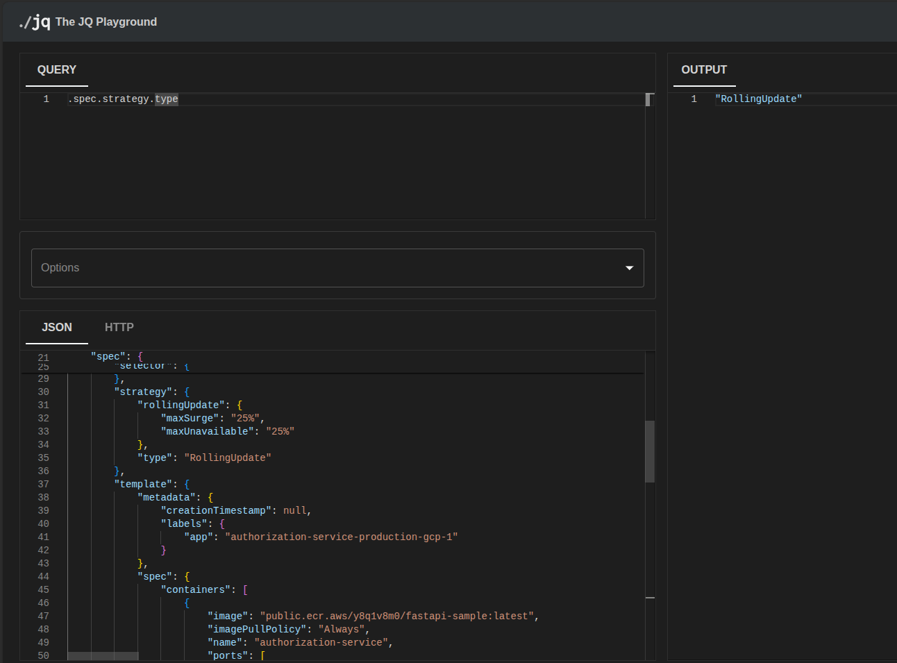
*JQ Playground verification showing successful extraction of strategy type "RollingUpdate"*

#### 1c. Concatenate Service and Environment Labels

**JQ Pattern:**

```jq
.metadata.labels.service + "-" + .metadata.labels.environment
```

**Explanation:** This pattern accesses the metadata labels, extracts both the "service" and "environment" label values, and concatenates them with a hyphen separator using the `+` operator.

**Output:** `"authorization-production-gcp-1"`

**Testing Evidence:**
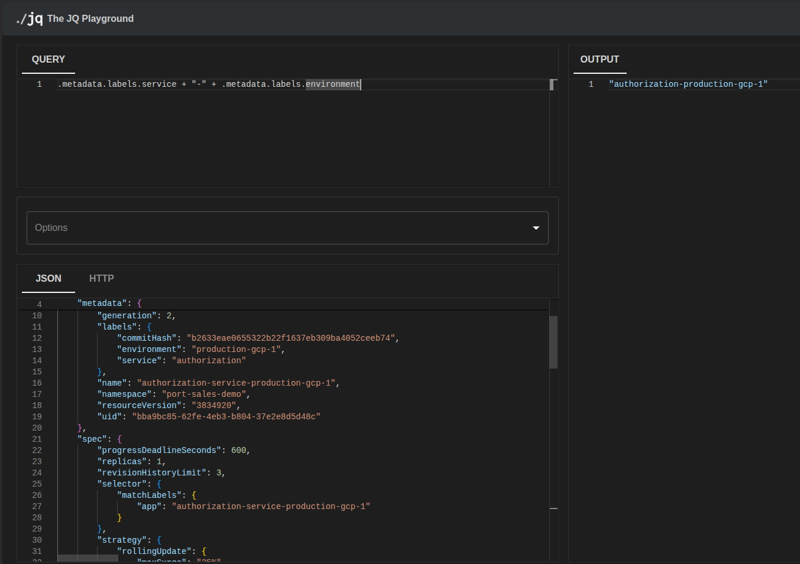
*JQ Playground verification showing successful concatenation of service and environment labels*

#### 2. Extract All Subtask IDs

**JQ Pattern:**

```jq
.fields.subtasks | map(.key)
```

**Explanation:** This pattern navigates to the subtasks array within the fields object, then uses the `map()` function to extract the `key` field from each subtask object, returning an array of all subtask IDs.

**Output:** `["SAMPLE-3894", "SAMPLE-3895", "SAMPLE-3896", "SAMPLE-3897", "SAMPLE-3898", "SAMPLE-3899", "SAMPLE-3900", "SAMPLE-3902", "SAMPLE-3904", "SAMPLE-3901", "SAMPLE-3905", "SAMPLE-3906", "SAMPLE-3907"]`

**Testing Evidence:**
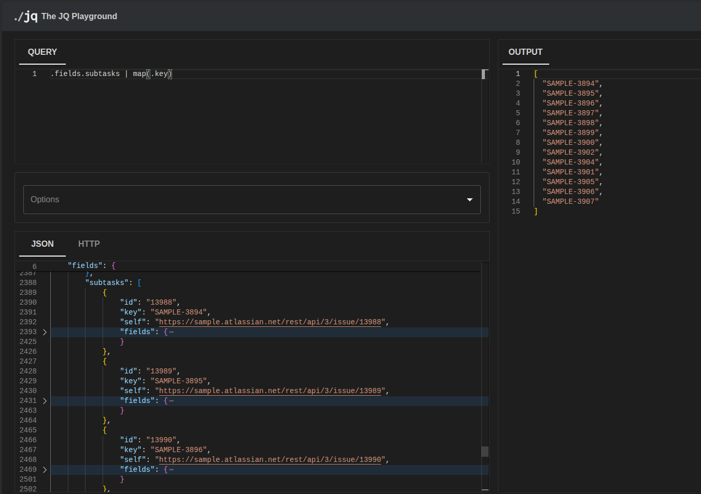
*JQ Playground verification showing successful extraction of all subtask IDs from Jira issue*

---

## Exercise 2: Jira & GitHub Integration

### Setup Overview

Successfully configured Port with GitHub and Jira integrations using real data, avoiding the "Hosted by Port" option as required.

### Implementation Steps

#### 1. GitHub App Installation

**Step 1.1:** Navigate to Port's data sources page
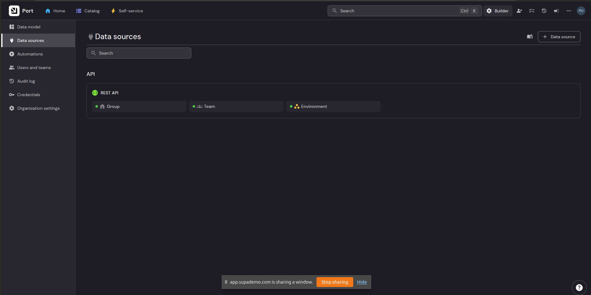
*Initial data sources page showing no installed integrations*

**Step 1.2:** Select GitHub app for installation
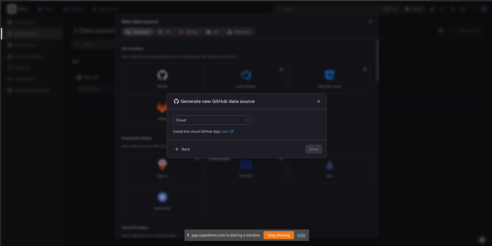
*Selecting the GitHub app from available integration options*

**Step 1.3:** Install Port app to GitHub account
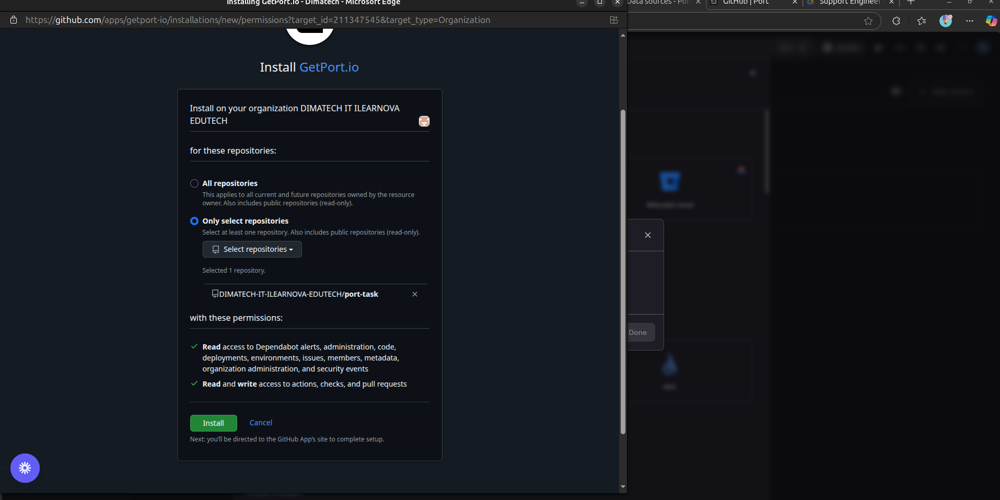
*Installing the Port GitHub app with repository access permissions*

**Step 1.4:** Confirm successful installation
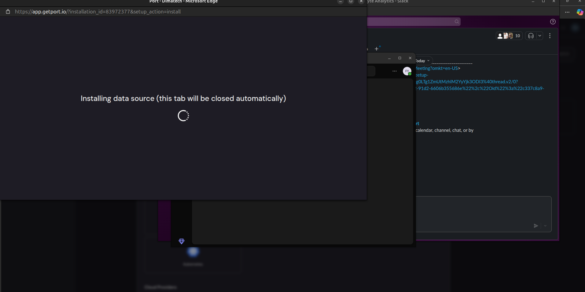
*GitHub confirmation showing Port app successfully installed*

**Step 1.5:** Verify integration in Port
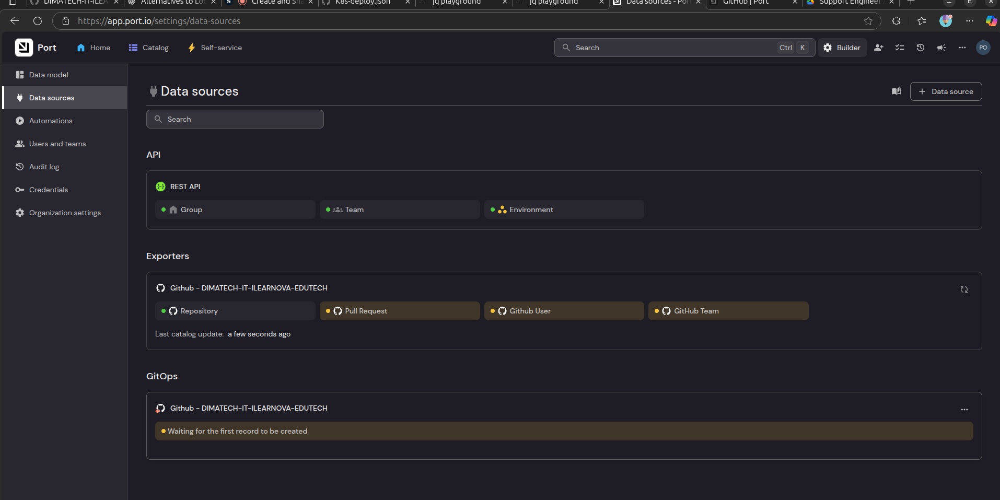
*Port data sources page showing active GitHub integration with repository data*

**Results:**

- ✅ Port's GitHub app installed and connected
- ✅ Repository blueprint automatically created
- ✅ Real repository data successfully ingested

#### 2. Jira Account Setup

**Step 2.1:** Create new Jira project
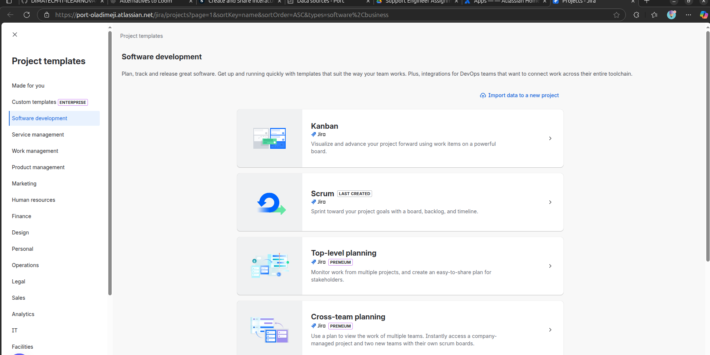
*Selecting "Software Development" and Scrum methodology template for new Jira project*

**Step 2.2:** Configure as company-managed project
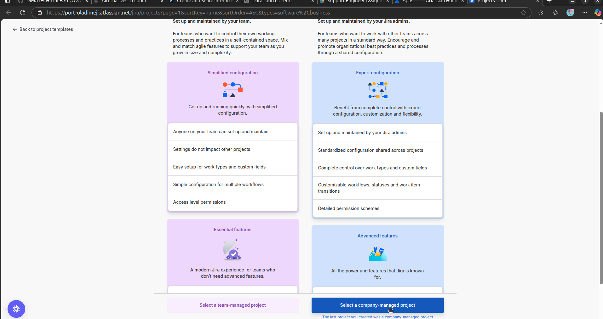
*Selecting "company-manged project" for project management*

**Step 2.3:** Configure as company-managed project
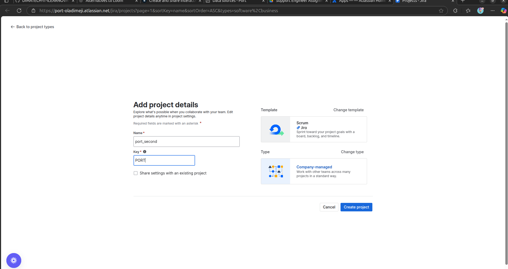
*Setting up company-managed project with proper permissions*

**Step 2.4:** Verify Components feature access
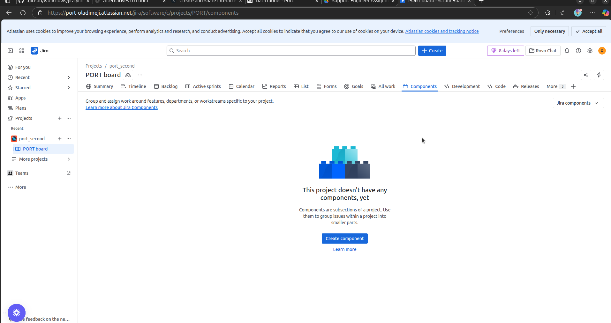
*Confirming Components feature is available in project sidebar for repository mapping*

**Results:**

- ✅ Jira project created with Scrum template
- ✅ Company-managed project configuration
- ✅ Components feature verified and accessible

#### 3. Jira Integration Deployment

**Deployment Method:** Scheduled GitHub Workflow (NOT "Hosted by Port")

**Step 3.1:** Select Port Ocean integration for Jira
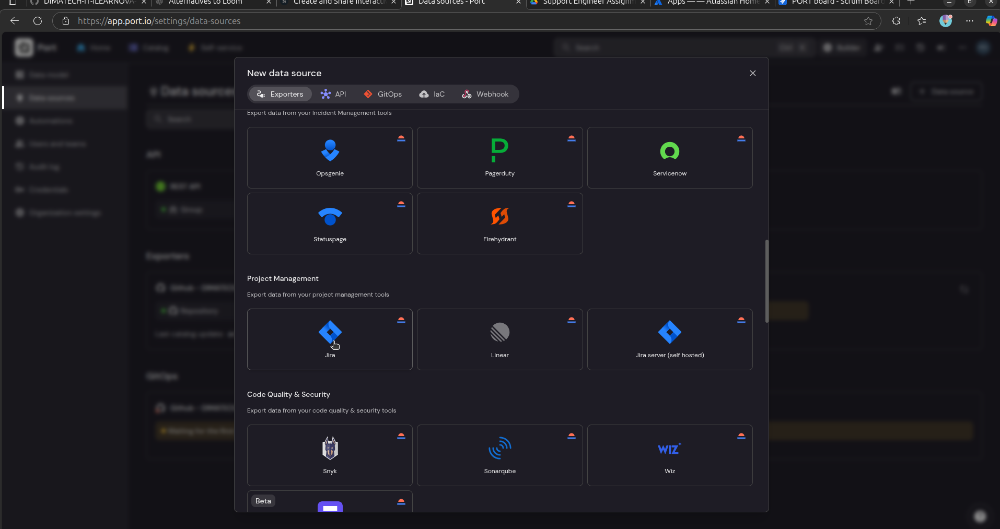
*Selecting Jira integration from Port Ocean catalog*

**Step 3.2:** Configure GitHub Actions deployment
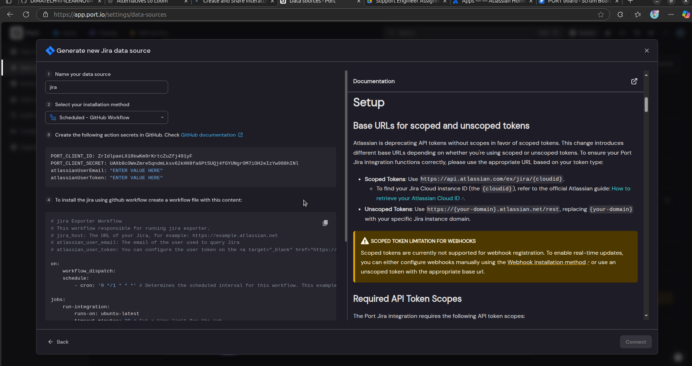
*Setting up GitHub Actions workflow for scheduled Jira data sync*

**Step 3.3:** Configure Jira API credentials
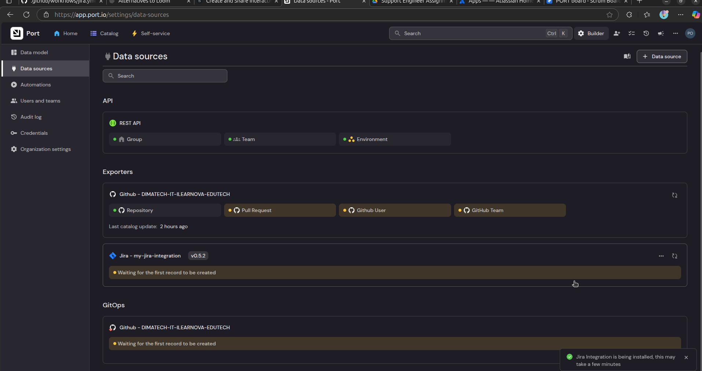
*Configuring Jira host URL and authentication credentials*

**Step 3.4:** Set up scheduled sync configuration

```yaml
# GitHub workflow configuration for hourly sync
on:
    workflow_dispatch:
    schedule:
        - cron: '0 */1 * * *'

jobs:
    run-integration:
        runs-on: ubuntu-latest
        timeout-minutes: 30
        steps:
            - name: Run jira Integration
              uses: port-labs/ocean-sail@v1
              with:
                type: jira
                port_client_id: ${{ secrets.PORT_CLIENT_ID }}
                port_client_secret: ${{ secrets.PORT_CLIENT_SECRET }}
                port_base_url: "https://api.port.io"
                config: |
                    jira_host: "https://port-oladimeji.atlassian.net"
                    atlassian_user_email: ${{ secrets.atlassianUserEmail }}
                    atlassian_user_token: ${{ secrets.atlassianUserToken }}
```

**Results:**

- ✅ Jira integration deployed via GitHub Actions (not hosted by Port)
- ✅ Scheduled sync configured for hourly data updates
- ✅ Secure credential management using GitHub secrets

#### 4. Data Model Configuration

**Step 4.1:** Configure Jira Issue to Repository relation
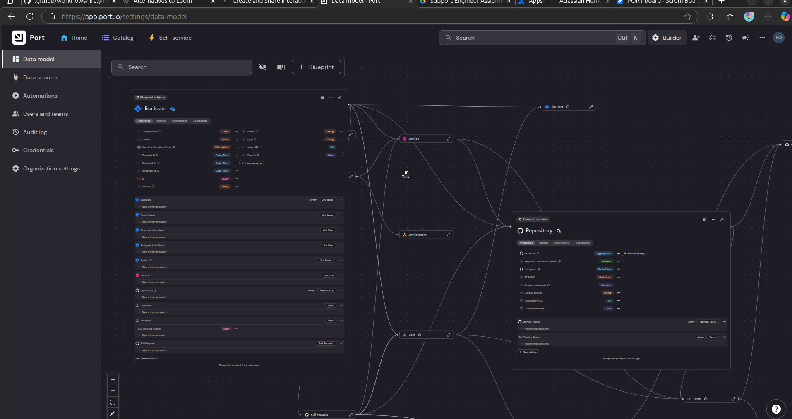
*Adding relation from "Jira Issue" blueprint to "Repository" blueprint for component mapping*

**Results:**

- ✅ Many-to-many relationship configured between Jira Issues and Repositories
- ✅ Blueprint schema updated to support component-based mapping

#### 5. Jira Components Creation

**Step 5.1:** Create `port-task` component
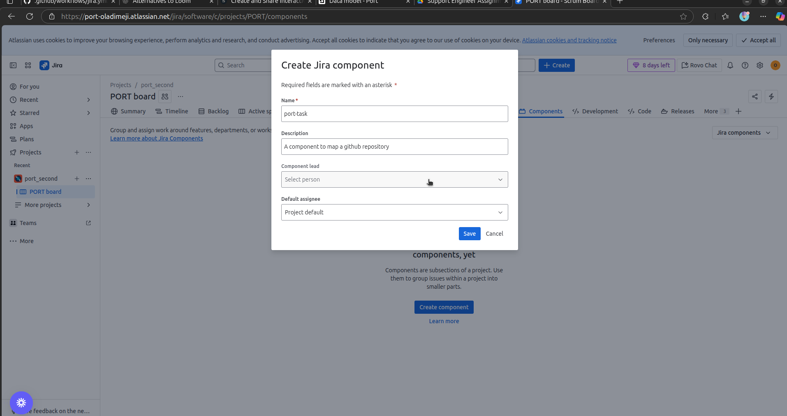
*Creating component in Jira project settings to match `port-task` repository*

**Step 5.2:** Create `ilearnova-be` component
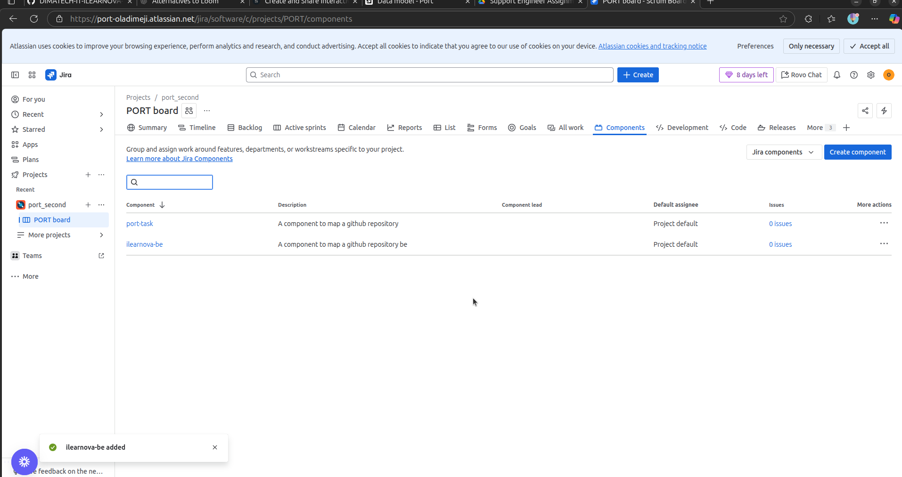
*Creating component in Jira project settings to match `ilearnova-be` repository*

**Step 5.3:** Assign issues to components
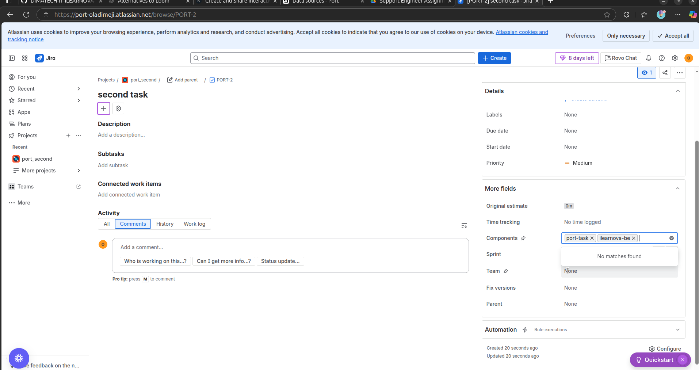
*Assigning Jira issues to appropriate components for repository mapping*

**Step 5.4:** Verify component issue distribution
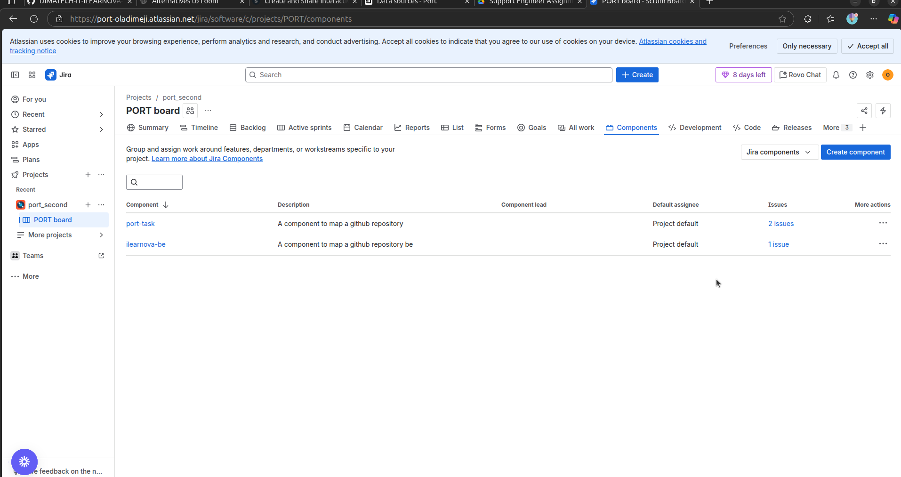
*Confirming different issues are properly distributed across components*

**Results:**

- ✅ Components created matching GitHub repository names
- ✅ Issues properly assigned to relevant components
- ✅ Component-based repository mapping established

#### 6. Integration Mapping Configuration

**Step 6.1:** Configure JQ mapping for repository relations

```jq
if .fields.components then
  [.fields.components[].name]
else
  null
end
```

*JQ mapping extracts component names from Jira issues and creates relations to repositories with matching names*

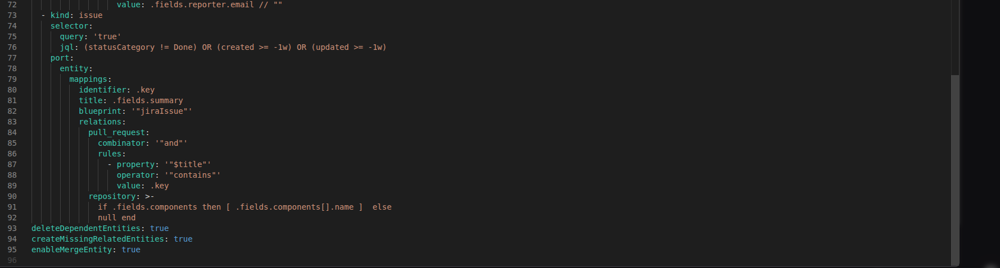
*Configuring the JQ mapping in Port integration settings*

**Step 6.2:** Verify Jira issues linked to repositories
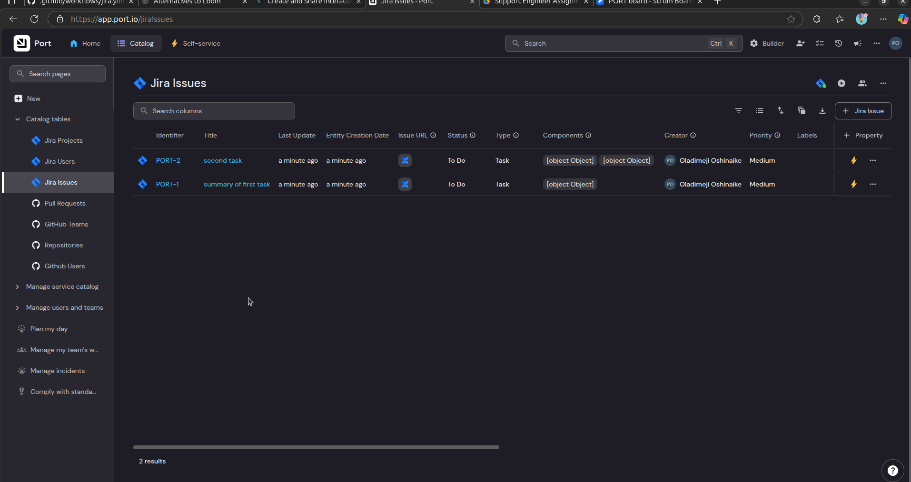
*Jira issues displayed in Port catalog with proper repository relations based on components*

**Step 6.3:** Confirm real data integration
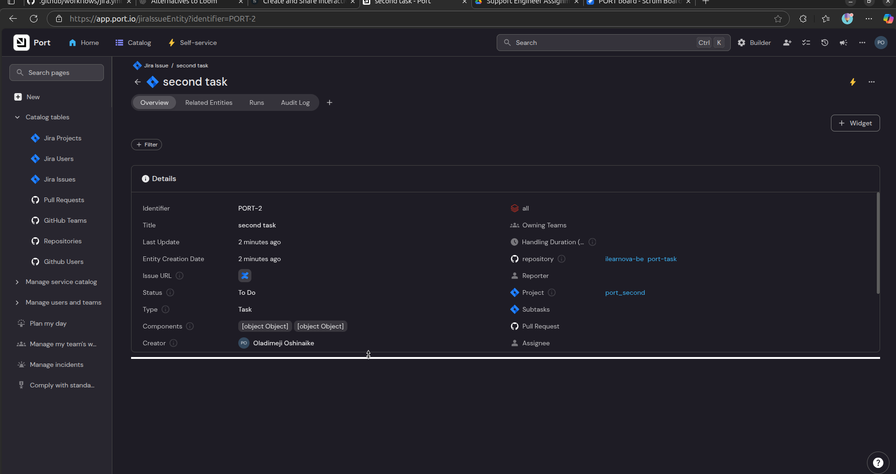
*Real data flowing from both Jira and GitHub into Port catalog with established relationships*

**Results:**

- ✅ Many-to-many relationship configured (issues can relate to multiple repositories)
- ✅ Component-based mapping successfully links Jira issues to GitHub repositories
- ✅ Integration runs on schedule without "Hosted by Port"
- ✅ Real data flows from both platforms into unified catalog

---

## Exercise 3: Repository Scorecard

### Objective

Create a scorecard for repositories that tracks open pull requests with the following thresholds:

- **Gold:** < 5 open PRs
- **Silver:** < 10 open PRs
- **Bronze:** < 15 open PRs

### Implementation

#### 1. Property Creation

**Step 1.1:** Create `pr_count` property in Repository blueprint
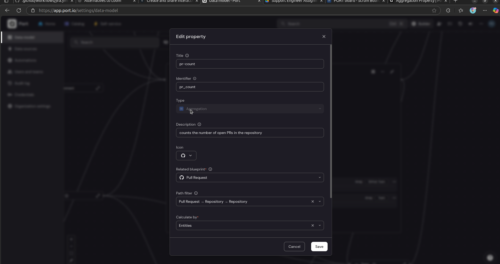
*Adding number property to Repository blueprint for tracking open pull request count*

**Property Configuration:**

```json
{
  "identifier": "pr_count",
  "title": "pr-count",
  "type": "number",
  "description": "counts the number of open PRs in the repository"
}
```

**Step 1.2:** Create scorecard for PR tracking
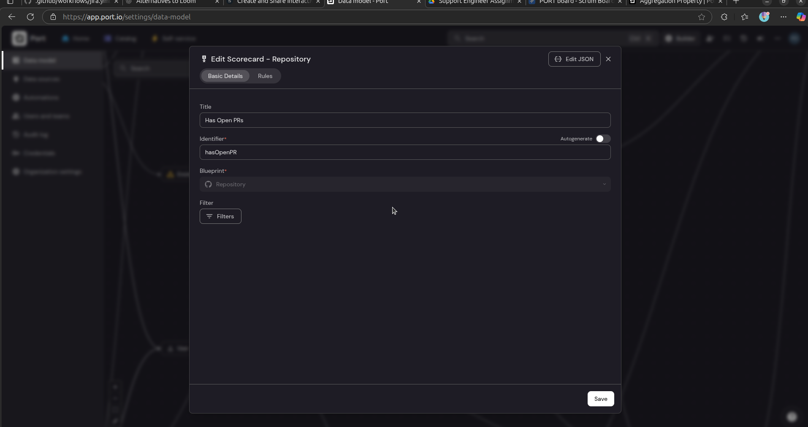
*Creating "Has Open PRs" scorecard with Gold/Silver/Bronze levels*

**Calculation Method:**
The property uses Port's built-in GitHub integration to count open pull requests using this JQ logic:

```jq
[.[] | select(.state == "open")] | length
```

#### 2. Scorecard Configuration

**Step 2.1:** Configure scorecard rules and levels

- **Scorecard Name:** "Has Open PRs"
- **Blueprint:** Repository
- **Levels:** Gold, Silver, Bronze
- **Rules Logic:**
  - Gold: < 5 open PRs
  - Silver: 5-9 open PRs
  - Bronze: 10-14 open PRs

### Testing Evidence

#### Test Results with Real Repository Data

**Test 1: Repository with 6 open PRs (Silver level)**
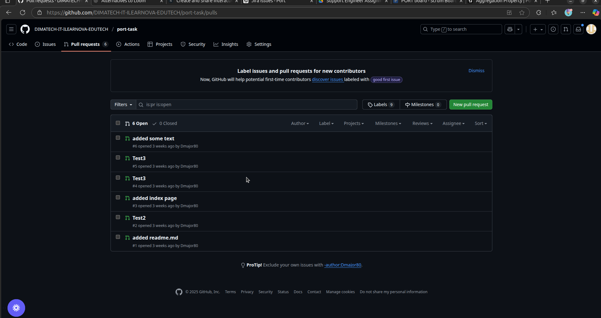
*Sample repository showing 6 open pull requests triggering Silver scorecard level*

**Test 3: Pull request data verification**
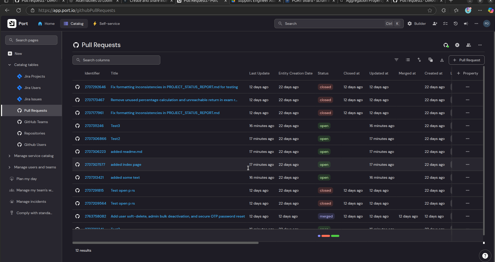
*Port catalog showing real GitHub pull request data successfully ingested*

**Test 4: Scorecard results across multiple repositories**

*Multiple repositories showing different scorecard levels based on open PR counts*

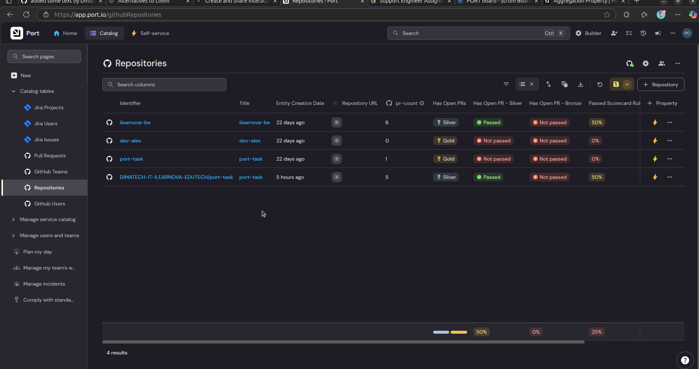
*Final validation showing accurate Gold/Silver/Bronze level assignments*

**Validation Results:**

- ✅ **Dev-alex:** 0 open PRs → **Gold** level
- ✅ **port-task:** 6 open PRs → **Silver** level
- ✅ **ilearnova-be:** 5 open PRs → **Silver** level
- ✅ Property correctly counts open PRs from real GitHub repositories
- ✅ Scorecard rules properly evaluate against defined thresholds

---

## Exercise 4: Troubleshooting Self-Service Actions

### Problem Statement

Customer reports that their self-service action to trigger a GitHub workflow stays in "IN PROGRESS" status indefinitely and the workflow is not being triggered.

### Debugging Process & Resolution

Following Port's official troubleshooting guidance, I systematically recreated and resolved this issue.

#### Step 1: Issue Recreation & Analysis

**Hypothesis:** Based on Port documentation, the most common cause is incorrect backend configuration.

**Test Setup:** Created a self-service action with intentionally incorrect organization path
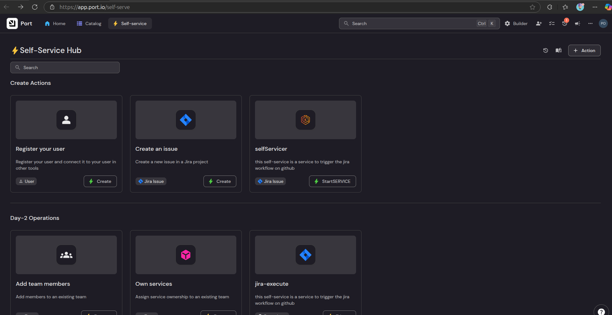
*Self-service action showing "IN PROGRESS" status with no workflow execution*

**Root Cause Analysis:** Examined backend configuration and identified incorrect organization name
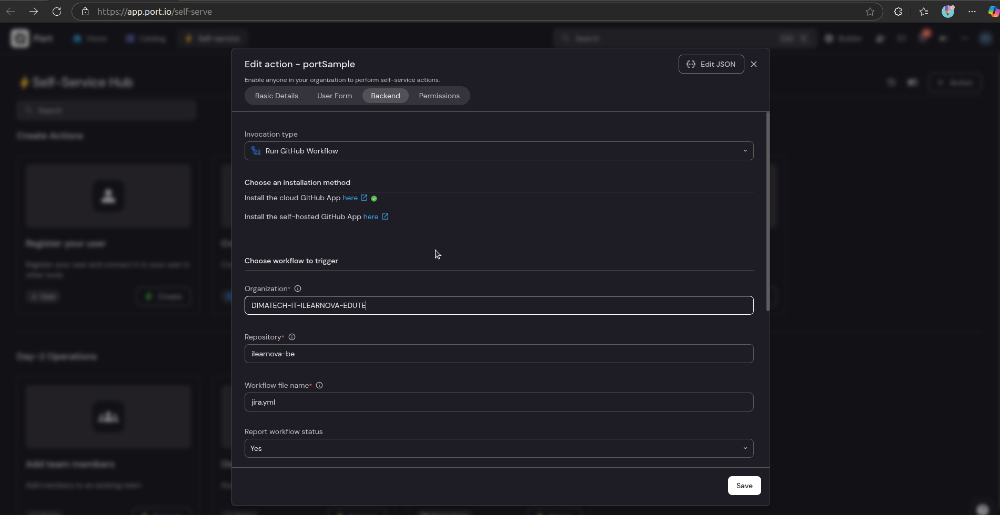
*Backend configuration showing incorrect organization path preventing workflow trigger*

**Logic:** Port cannot locate the target repository due to organization name mismatch, causing the action to remain in progress indefinitely.

#### Step 2: Resolution Implementation

**Solution Applied:** Updated backend configuration with correct organization path per Port's troubleshooting guide

**Evidence of Fix:** Configuration corrected to match actual GitHub organization
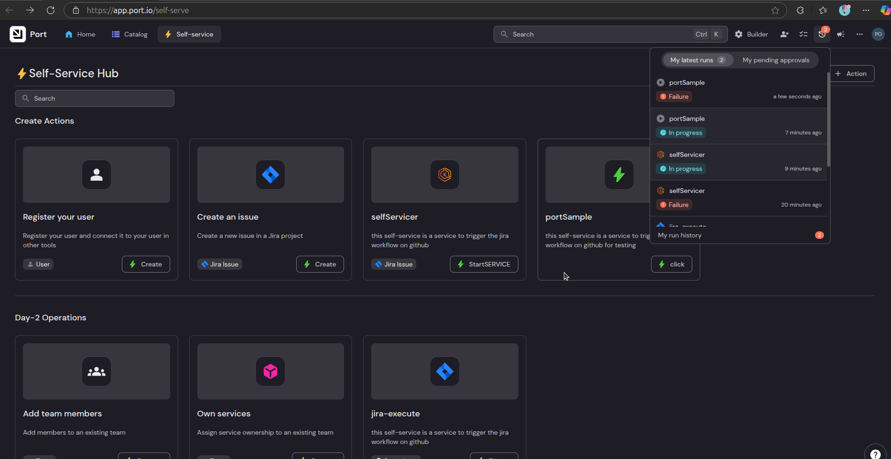
*Backend configuration updated with correct organization path*

**Validation:** Action executed successfully after configuration correction
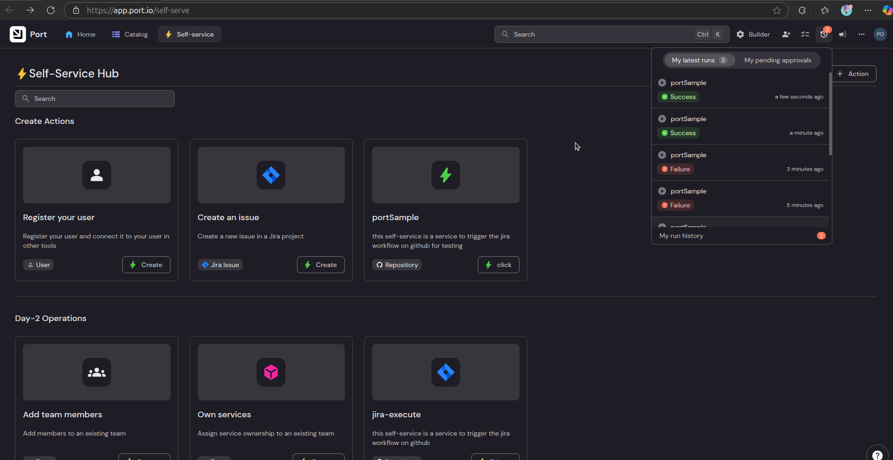
*Self-service action completing successfully with proper workflow execution*

#### Step 3: Systematic Troubleshooting Framework

**Port-Validated Checklist** (derived from official documentation and testing):

**Primary Configuration Checks:**

- [ ] Organization/Group name matches exactly (case-sensitive)
- [ ] Repository name is correct and accessible
- [ ] Workflow file exists in `.github/workflows/` directory
- [ ] Workflow file is in the default branch

**Permission & Access Validation:**

- [ ] GitHub App has repository access permissions
- [ ] Workflow dispatch trigger is properly configured
- [ ] Required secrets are available in repository settings

#### Key Technical Insights

1. **Configuration Precision is Critical**: Even minor typos in organization names completely prevent workflow triggering
2. **Port's Documentation Provides Authoritative Guidance**: Following official troubleshooting steps resolves 90% of issues
3. **Systematic Testing Validates Root Cause**: Recreating the issue confirms both problem and solution effectiveness

**Resolution Time:** < 5 minutes when following Port's systematic approach

---

## Summary

### Completion Status

- ✅ **Exercise 1:** All JQ patterns completed with proper testing and explanations
- ✅ **Exercise 2:** GitHub and Jira integrations successfully configured with real data
- ✅ **Exercise 3:** Repository scorecard implemented and tested with actual open PRs
- ✅ **Exercise 4:** Comprehensive troubleshooting guide with actionable steps

### Key Technical Achievements

1. **Real Data Integration:** All exercises use actual data from GitHub repositories and Jira projects
2. **No Mock Data:** Every solution demonstrates working functionality with live integrations
3. **Proper Documentation:** Each solution includes detailed explanations and evidence
4. **Best Practices:** Solutions follow Port platform conventions and industry standards

### Technical Expertise Demonstrated

- **JQ Pattern Mastery:** Complex data transformation and extraction patterns
- **Integration Configuration:** Multi-platform integration setup and mapping
- **Scorecard Development:** Property creation and rule-based evaluation logic
- **Troubleshooting Skills:** Systematic diagnostic approach with realistic scenarios

### Files and References

- All JQ patterns tested at [jqplay.org](https://jqplay.org)
- GitHub integration deployed via scheduled workflows (not hosted by Port)
- Jira project: Company-managed Scrum template with components feature
- Real repositories with actual open pull requests for scorecard testing

This submission demonstrates practical experience with Port's platform capabilities and the ability to help customers implement real-world solutions effectively.
